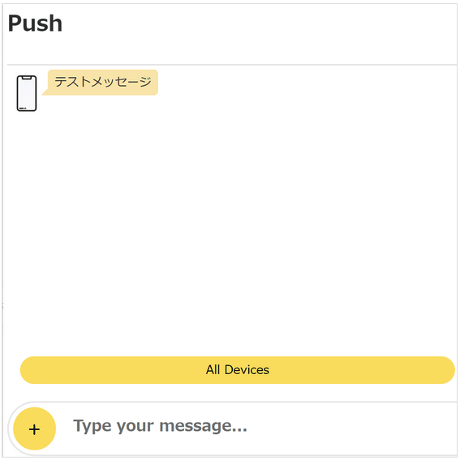
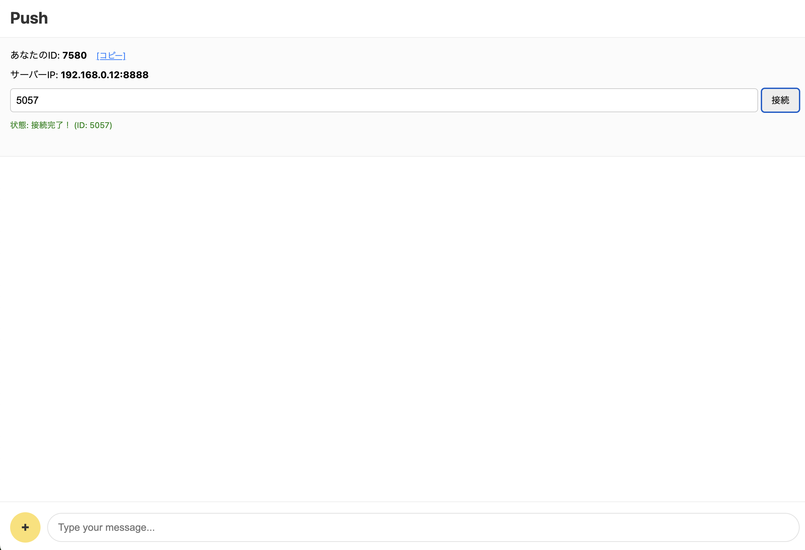
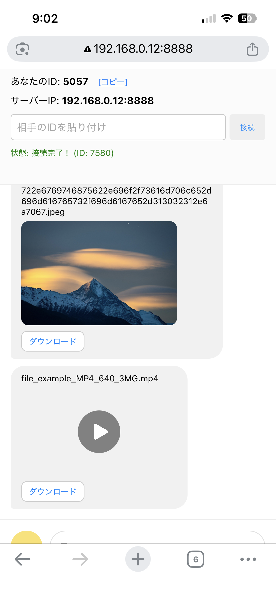
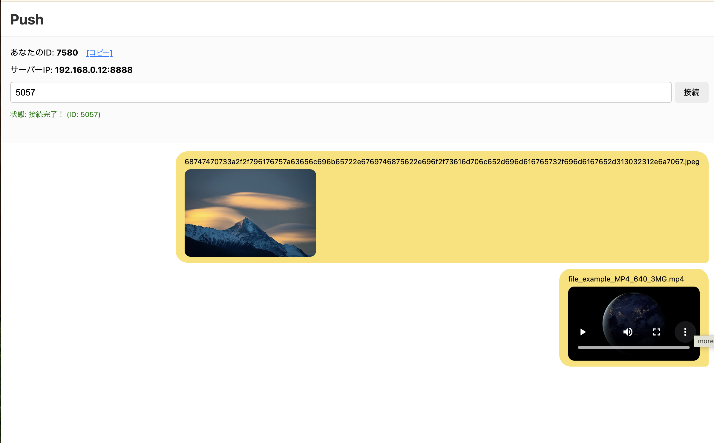

# LocalPush

Inspired by 
- [nowpush](https://github.com/nowpush/nowpush-node)
- [LocalSend](https://localsend.org/)

## Screenshots / スクリーンショット /

| Main View | Chat and Connection | Transfer Progress | Download Flow |
|---|---|---|---|
|  |  |  |  |

## PWA Install

- 日本語: スマホのブラウザで開き、「ホーム画面に追加」を実行してください。
- English: Open in a mobile browser and use "Add to Home Screen".
- Deutsch: Im mobilen Browser öffnen und "Zum Home-Bildschirm hinzufügen" ausführen.

## 日本語

### 概要
LocalPush は、PeerJS を使ってブラウザ同士でファイル/メッセージをやり取りできるシンプルな P2P Web アプリです。  
`python main.py` でローカルサーバーを起動し、`index.html` を表示します。

### 主な機能
- テキストチャット（Enter 送信）
- 任意ファイルの送信（チャンク分割送信）
- 受信中の進捗表示（吹き出し内に `受信中... XX%`）
- 画像/動画/音声のプレビュー表示
- 受信ファイルのダウンロードボタン
  - 対応ブラウザでは保存ダイアログ（エクスプローラ）で保存先選択
  - 非対応ブラウザでは通常ダウンロード
- サーバーIP表示（`/server-info`）

### 動作要件
- Python 3.9 以上（推奨）
- モダンブラウザ（Chrome/Edge/Safari/Firefox など）

### セットアップ
```bash
python main.py
```

### アクセス先
- ローカル: `http://localhost:8888`
- 同一ネットワーク内: 起動時に表示される `Local network address`（例: `http://192.168.0.10:8888`）

### 使い方
1. 2つの端末でページを開く
2. 片方の「あなたのID」をもう片方に共有
3. 相手IDを入力して「接続」
4. テキスト送信 or `+` ボタンからファイル送信
5. 受信側でプレビュー確認後、`ダウンロード` ボタンで保存

### 注意事項
- ファイル種別は制限なし（プレビューは画像/動画/音声のみ）
- P2P 通信品質はネットワーク環境に依存します

---

## English

### Overview
LocalPush is a simple P2P web app built with PeerJS for exchanging messages and files directly between browsers.  
Run `python main.py` to start a local server and serve `index.html`.

### Features
- Text chat (send with Enter)
- Any-file transfer with chunked sending
- Receive progress in chat bubble (`Receiving... XX%`)
- Inline preview for image/video/audio files
- Download button for received files
  - Save dialog (file explorer) when supported
  - Fallback to regular browser download otherwise
- Server IP display via `/server-info`

### Requirements
- Python 3.9+ (recommended)
- Modern browser (Chrome/Edge/Safari/Firefox)

### Setup
```bash
python main.py
```

### URLs
- Local: `http://localhost:8888`
- Same LAN: `Local network address` printed on startup (for example `http://192.168.0.10:8888`)

### Usage
1. Open the page on two devices/tabs
2. Share one side's ID with the other side
3. Enter the target ID and click `Connect`
4. Send text or choose a file with the `+` button
5. On receiver side, preview (if supported) and click `Download`

### Notes
- File type is unrestricted (preview is available for image/video/audio only)
- P2P transfer quality depends on network conditions

---

## Deutsch

### Überblick
LocalPush ist eine einfache P2P-Webanwendung auf Basis von PeerJS, mit der Browser direkt Nachrichten und Dateien austauschen können.  
Mit `python main.py` startest du den lokalen Server und lieferst `index.html` aus.

### Funktionen
- Text-Chat (Senden mit Enter)
- Versand beliebiger Dateien per Chunk-Übertragung
- Fortschrittsanzeige beim Empfang im Chat-Bubble (`Empfang... XX%`)
- Vorschau für Bild/Video/Audio
- Download-Button für empfangene Dateien
  - Speicherdialog (Datei-Explorer), wenn unterstützt
  - Sonst normaler Browser-Download
- Anzeige der Server-IP über `/server-info`

### Voraussetzungen
- Python 3.9+ (empfohlen)
- Moderner Browser (Chrome/Edge/Safari/Firefox)

### Einrichtung
```bash
python main.py
```

### Aufruf
- Lokal: `http://localhost:8888`
- Im gleichen LAN: Beim Start ausgegebene `Local network address` (z. B. `http://192.168.0.10:8888`)

### Verwendung
1. Seite auf zwei Geräten/Tabs öffnen
2. ID von einer Seite zur anderen teilen
3. Ziel-ID eingeben und `Connect` klicken
4. Text senden oder Datei über `+` auswählen
5. Auf der Empfängerseite Vorschau prüfen und `Download` klicken

### Hinweise
- Dateitypen sind nicht eingeschränkt (Vorschau nur für Bild/Video/Audio)
- P2P-Übertragung hängt von der Netzwerkqualität ab
